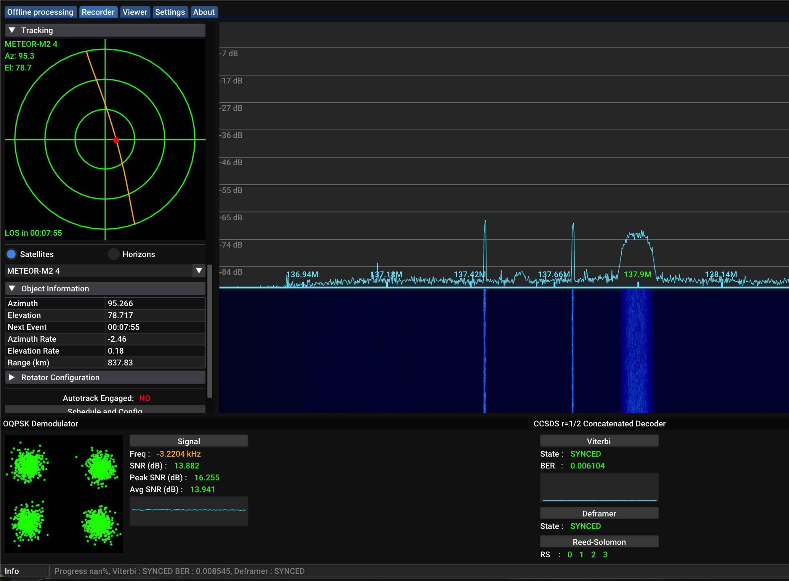

# LRPT 🛰️

My personal archive of METEOR-M2 LRPT satellite passes received from Wayne County, Michigan.

<figure>
  
  <figcaption>Captured 2026-05-11. Satellite: METEOR-M2-4, 87° max elevation. Best pass to date</figcaption>
</figure>

## About LRPT
LRPT - [Low Rate Picture Transmission](https://en.wikipedia.org/wiki/Low-rate_picture_transmission)

[Beginner's guide](https://blog.metislair.com/docs/Radio/Beginners%20guide%20to%20weather%20satellite%20reception.html#preamble) (great resource)

## My Setup

- **Receiver**: [RTL-SDR Blog V4](https://www.rtl-sdr.com/about-rtl-sdr/)
- **Antenna**: V-dipole, backyard deployment
- **Software**: [SatDump](https://www.satdump.org/), [gpredict](https://oz9aec.dk/gpredict/)
- **Frequency**: 137.9 MHz
- **Typical gain**: 40 dB (low elevation passes: 44 - 48 dB)



SatDump software shown during peak elevation (78°), capturing LRPT on 137.9 MHz. Decoder pipeline at bottom indicates synced status.

## Repository Structure

```
data/
  2026-05-09_20-06_meteor_m2-x_lrpt_137.9 MHz/
    dataset.json                      # Satellite name, timestamp, metadata
    telemetry.json                    # Satellite housekeeping (channel modes, instrument status)
    MSU-MR/
      msu_mr_rgb_MSA_corrected.png    # Best composite image
      MSU-MR-1.png                    # Channel 1 (visible)
      MSU-MR-2.png                    # Channel 2 (visible)
      MSU-MR-3.png                    # Channel 3 (near-infrared)
pull-data.sh                          # Copies key files from SatDump live_output into data/
blackrow-analysis.py                  # Identifies black row clusters in an image and maps them to elapsed pass time
```

## Scripts

### `pull-data.sh`

Copies the key files from a SatDump output directory into `data/`. Skips passes that already exist — will not overwrite existing passes.

```bash
./pull-data.sh ~/Documents/live_output
```

### `blackrow-analysis.py`

Scans a decoded image for black row clusters and reports their position in elapsed time from AOS. Useful for correlating dropout artifacts with pass elevation and diagnosing causes (multipath nulls, low SNR segments, deframer hiccups).

```bash
python3 blackrow-analysis.py data/2026-05-09_20-06_meteor_m2-x_lrpt_137.9\ MHz/MSU-MR/msu_mr_rgb_MSA_corrected.png
```

## Pass Log (incomplete)

| Date | Satellite | Max El | Direction | Peak SNR | Notes |
|------|-----------|--------|-----------|----------|-------|
| 2026-05-11 | METEOR-M2-4 | 11.8° | Northbound | 7.47 | First with DIY V-dipole antenna. Surprisingly decent for 11.8 elevation |
| 2026-05-11 | METEOR-M2-4 | 87.44° | Northbound | 16.364 | Best one to date. Near-perfect elevation | 
| 2026-05-11 | METEOR-M2-3 | 47.51° |  | — | Average | 
| 2026-05-09 | METEOR-M2-4 | 38° | Northbound | 13.4 dB | - |
| 2026-05-02 | METEOR-M2-4 | 78° | — | — | First great image |
